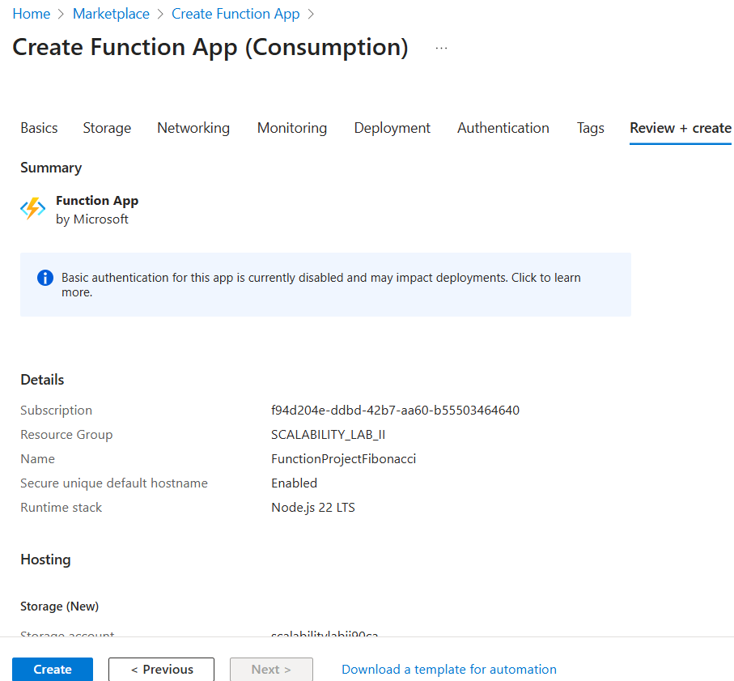
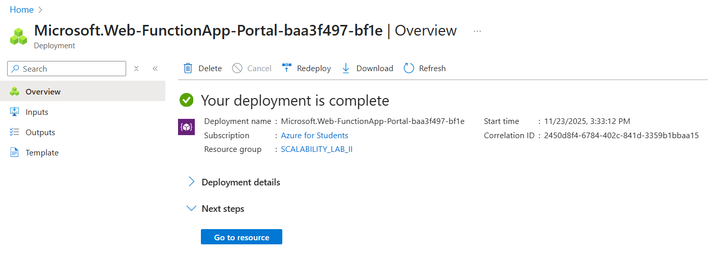
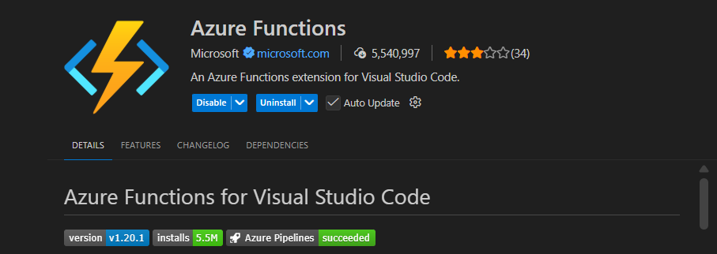
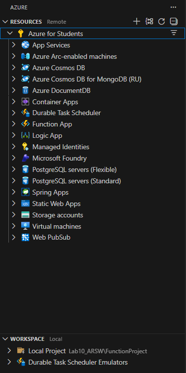
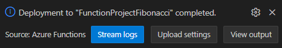
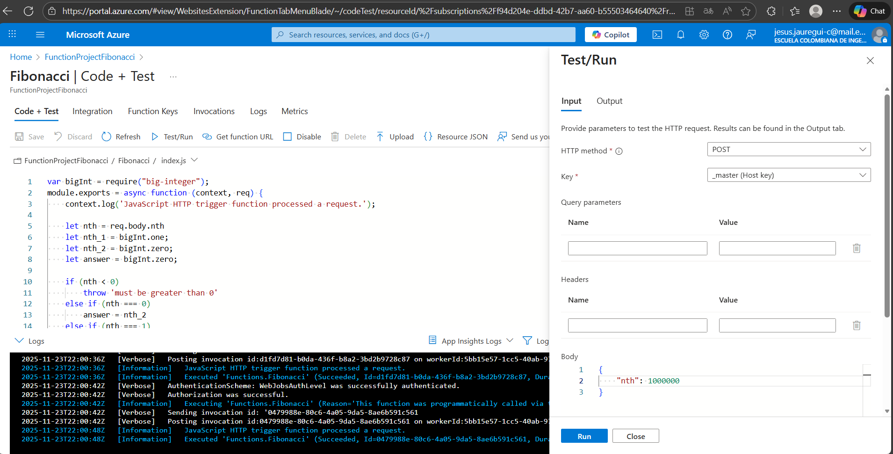
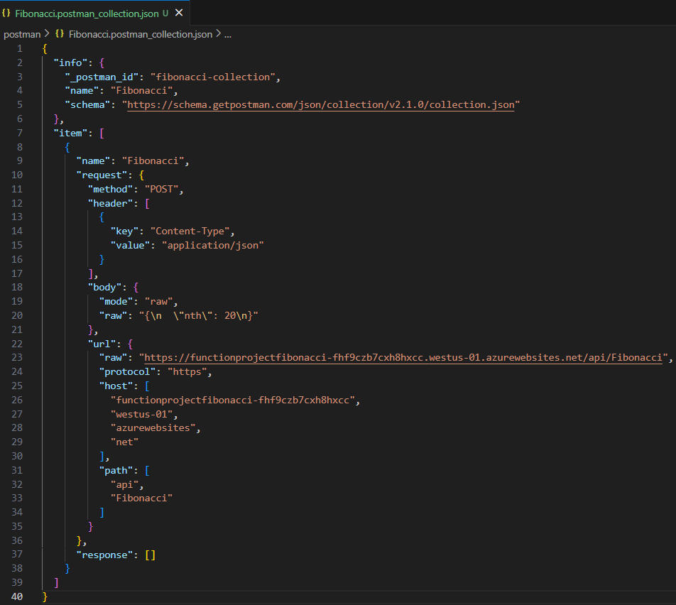
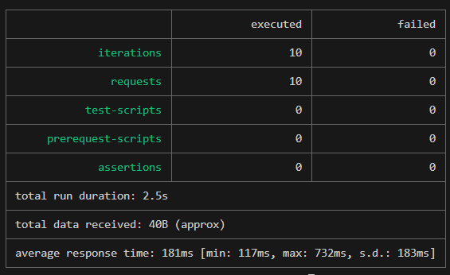
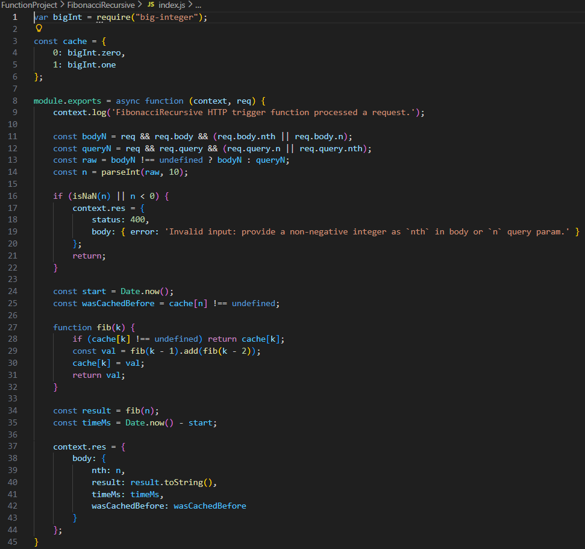

### Escuela Colombiana de Ingeniería
### Arquitecturas de Software - ARSW

## Escalamiento en Azure con Maquinas Virtuales, Sacale Sets y Service Plans

### Dependencias
* Cree una cuenta gratuita dentro de Azure. Para hacerlo puede guiarse de esta [documentación](https://azure.microsoft.com/es-es/free/students/). Al hacerlo usted contará con $100 USD para gastar durante 12 meses.
Antes de iniciar con el laboratorio, revise la siguiente documentación sobre las [Azure Functions](https://www.c-sharpcorner.com/article/an-overview-of-azure-functions/)

### Parte 0 - Entendiendo el escenario de calidad

Adjunto a este laboratorio usted podrá encontrar una aplicación totalmente desarrollada que tiene como objetivo calcular el enésimo valor de la secuencia de Fibonnaci.

**Escalabilidad**
Cuando un conjunto de usuarios consulta un enésimo número (superior a 1000000) de la secuencia de Fibonacci de forma concurrente y el sistema se encuentra bajo condiciones normales de operación, todas las peticiones deben ser respondidas y el consumo de CPU del sistema no puede superar el 70%.

### Escalabilidad Serverless (Functions)

1. Cree una Function App tal cual como se muestra en las  imagenes.

2. Instale la extensión de **Azure Functions** para Visual Studio Code.

3. Despliegue la Function de Fibonacci a Azure usando Visual Studio Code. La primera vez que lo haga se le va a pedir autenticarse, siga las instrucciones.

4. Dirijase al portal de Azure y pruebe la function.

5. Modifique la coleción de POSTMAN con NEWMAN de tal forma que pueda enviar 10 peticiones concurrentes. Verifique los resultados y presente un informe.

[Informe de newman](/postman/newman_report.txt)

6. Cree una nueva Function que resuleva el problema de Fibonacci pero esta vez utilice un enfoque recursivo con memoization. Pruebe la función varias veces, después no haga nada por al menos 5 minutos. Pruebe la función de nuevo con los valores anteriores. ¿Cuál es el comportamiento?.

    Resultados observados:

    - Primera llamada para un n grande respondió con wasCachedBefore: false.
    - Repetición inmediata devolvió wasCachedBefore: true — el cache de módulo se mantiene mientras la instancia está caliente.
    - Después de 5 minutos de inactividad las llamadas mostraron wasCachedBefore: false otra vez — la caché no persistió (probablemente la instancia se recicló o el proceso se reinició).

    Conclusión:

    - El memoization funciona dentro del mismo proceso/instancia y acelera llamadas repetidas.
    - Si la instancia se apaga o recicla tras inactividad, la cache de memoria se pierde y la primera llamada posterior vuelve a calcular y repoblar la cache.

**Preguntas**

* ¿Qué es un Azure Function?

    Una Azure Function es un servicio de cómputo serverless de Microsoft Azure que permite ejecutar código en respuesta a eventos, sin necesidad de administrar servidores.
    Solo escribes la función, defines el trigger (evento que la activa) y Azure se encarga de escalar, ejecutar y detener cuando no se usa.

* ¿Qué es serverless?

    Serverless no significa “sin servidores”, sino:
    - No administras servidores (Azure lo hace).
    - Escalado automático.
    - Pagas solo por el tiempo de ejecución y recursos usados.
    - No pagas por capacidad ociosos (especialmente en Consumption Plan).

    Es ideal para cargas event–driven, intermitentes o muy variables.

* ¿Qué es el runtime y que implica seleccionarlo al momento de crear el Function App?

    El runtime es el entorno que permite ejecutar las funciones, incluyendo:
    - Lenguaje (Node.js, Python, Java, C#, PowerShell, etc.)
    - Versión del runtime (v4 es el más actual)
    - Compatibilidad con extensiones
    - Modelo de hospedaje

    Al seleccionarlo, se elige:
    - Qué lenguajes puedes usar
    - Qué versiones de esos lenguajes (ej: Node 18 vs Node 20)
    - Cómo se comportará internamente el motor de ejecución
    - Cómo será el soporte futuro

    Si se elige un runtime obsoleto, se podría tener incompatibilidades o quedar sin soporte.

* ¿Por qué es necesario crear un Storage Account de la mano de un Function App?

    Un Function App siempre necesita un Storage Account, porque Azure lo usa internamente para:
    - Guardar logs y estado interno
    - Administrar los triggers (ej: timer, cola, eventos)
    - Manejar archivos temporales
    - Controlar el host.json y otros archivos de configuración
    - Coordinar el escalado automático

    Sin un Storage Account, el Function App no puede funcionar.

* ¿Cuáles son los tipos de planes para un Function App?, ¿En qué se diferencias?, mencione ventajas y desventajas de cada uno de ellos.

    1. Flex Consumption Plan
    
        - Es la versión más avanzada “serverless” según Microsoft.

        - Solo soporta Linux para código (“code-only” en Linux).

        - Escala muy rápido (“fast event-driven scaling”), y lo hace por función (“per-function scaling”).

        - Límite máximo de instancias según documento: hasta 1000 instancias para este plan.

        - Time-out por ejecución: por defecto 30 minutos y “sin límite máximo” (unbounded) para este plan.

        - Comportamiento de “cold start”: tiene mejoras, y además puedes tener instancias “always ready” (si configuras algunos nodos permanentemente listos) para reducir retrasos de arranque.

        - Redes (networking): permite integración con VNet.

        - Facturación: según ejecución y memoria (“memory of instances when … executing”), y también por las instancias always ready si hay.

        Ventajas:
        - Máxima elasticidad.

        - Es servidor “serverless real”: se puede pagar solo cuando hay ejecución.

        - Buen soporte para workloads variables y muy event-driven.

        - Red privada (VNet) si se necesita.
    
        Desventajas:
        - Si se configuran instancias siempre listas (“always ready”), tienes costo base permanente.
        
        - Puede haber más complejidad para configurar esa opción “always ready”.
        
        - No es tan predecible el costo si hay muchas instancias “on demand”.

    2. Premium Plan
    
        - Permite instancias “precalentadas” (“prewarmed”) para evitar cold starts. 
        
        - Escalado automático basado en demanda de eventos (“event driven”). 
       
        - Soporta ejecución más larga: puedes configurar “functionTimeout” para hacer que la ejecución sea ilimitada (“unbounded”) según host.json. 
        
        - Integración con VNet: se puede conectar con redes privadas. 
        
        - Tamaños de instancia configurables: EP1, EP2, EP3 con diferentes núcleos (vCPU) y memoria. 
        
        - Facturación: basado en “core-seconds” (vCPU) y memoria asignada para cada instancia, incluyendo las pre-calentadas. 
        
        - Mínimo un nodo siempre activo (“at least one instance per plan must always be kept warm”). 
        
        - Número máximo de instancias (“scale out”): según Microsoft, puede llegar hasta 100 instancias (para Windows). 
        
        - Timeout por ejecución: por defecto 30 min (pero puede ser ilimitado) según host.json. 
        
        Ventajas:
        
        - No hay cold start (o es muy reducido si configuras prewarmed).
        Capacidad para cargas constantes o de alta duración.
        - Escalado automático con control (puedes definir mínimo y máximo de instancias).
        - VNet y aislamiento de red posible.
        
        Desventajas:

        - Siempre se paga al menos una instancia (aunque no haya ejecución), lo que sube el costo base.
        - Si se escala mucho, puede ser caro (muchas instancias).
        - Requiere más planificación para definir cuántas “always ready” instancias necesitas.
    
    3. Dedicated Plan (App Service Plan)

        - Es básicamente el mismo plan de App Service para Web Apps, pero funcionando con Functions. 
        - Escalado manual o por “autoscale” (pero más lento que en Premium). 
        - Timeout también puede ser “unbounded” si se configura correctamente.
        - “Always On” se suele usar para que la aplicación no entre en estado inactivo (dado que no es serverless puro). 
        - Facturación: se paga el App Service Plan normal, no facturación por ejecución. 
        - Instancias máximas: según el tipo de App Service, autoscale permite entre 10–30 instancias normalmente, aunque con App Service Environment (ASE) puede ser más.
        
        Ventajas:
        
        - Costos previsibles si la aplicación siempre está activa.
        - No dependes tanto de escalado “rápido” para responder a picos, si se tiene los VMs ya previstos.
        - Puedes reutilizar un App Service Plan si ya se tiene otras apps ahí.
        - Control total sobre la infraestructura (más “tradicional”).

        Desventajas:
        
        - No es verdaderamente “serverless”: sigues pagando por el servidor aunque no haya carga.
        - Escalado menos dinámico comparado con Premium o Flex Consumption.
        - Si se sube mucho la carga, necesita planificar manualmente la escalabilidad.

    4. Container Apps

        - No es exactamente un “Function App” tradicional, sino que ejecutas tus funciones dentro de contenedores gestionados por Azure Container Apps. 
        - Escalado event-driven (como los otros planes) dentro del contexto de Container Apps. 
        - Máximo de instancias: según la documentación, puede escalar hasta 300-1000 réplicas, dependiendo la configuración. 
        - Timeout por función: “unbounded” (según su tabla de servicio) si configuras host.json. 
        - Networking: soporta restricciones de IP y endpoints privados (dependiendo de configuración). 
        - Facturación: se basa en lo que uses en Container Apps (no solo por ejecución de funciones). 
        
        Ventajas:
        
        - Gran flexibilidad: se puede usar su propio contenedor con dependencias, librerías, runtimes custom.
        - Buen aislamiento: si necesitas empaquetar muchas dependencias o un entorno específico.
        - Muy útil para arquitecturas microservicios con funciones.
        
        Desventajas:
        
        - Overhead de contenedor (arranque, imagen, tamaño).
        - Posible costo mayor si las réplicas son muchas o si el contenedor es pesado.
        - Requiere más conocimiento de contenedores y despliegue.

    5. Consumption Plan
    
        - Es el plan tradicional de serverless de Azure Functions (“pay-as-you-go”). 
        - Escalado automático basado en eventos (“event driven”). 
        - Límite de instancias: para Windows, hasta 200 instancias según la documentación. 
        - Timeout por función: por defecto 5 minutos; máximo 10 minutos. 
        - Cold start: sí, porque escala a cero cuando no hay eventos. 
        - Facturación: pagas por número de ejecuciones, tiempo de ejecución y memoria utilizada. 
        
        Ventajas:
        
        - Muy económico para cargas intermitentes.
        - Escala a cero: no hay costo cuando no hay ejecuciones.
        - Billing muy granular.
        
        Desventajas:
        
        - Cold start puede impactar si necesitas baja latencia.
        - Límite de tiempo por ejecución (5–10 min) puede no servir para procesos largos.
        - Memoria y CPU por instancia pueden ser limitados.

* ¿Por qué la memoization falla o no funciona de forma correcta?
    - Stack Overflow: La versión recursiva simple llama a fib(n-1) y fib(n-2) con profundidad O(n). Para valores muy grandes (por ejemplo, n = 100000), la pila de V8 se desborda y la invocación falla (error 500).

    - Uso de memoria: La memoización clásica guarda F(0..n). Para valores grandes, la tabla y los objetos big-integer ocupan mucha memoria, lo que puede provocar OOM o que el host termine el proceso.

    - Límites del host y timeouts: Azure Functions puede imponer límites de tiempo y memoria; serializar números con decenas de miles de dígitos puede exceder el timeout o consumir demasiada CPU.

    - Cache volátil: El cache en memoria del módulo no persiste entre reinicios o instancias (cold start / reciclado). Por ello, un primer request tras un reinicio no se beneficia de la memoización.

    - Coste de big-integer: Las operaciones con enteros muy grandes son costosas; incluso con memoización, calcular y enviar resultados gigantes puede ser lento o pesado.

    Conclusión: Para n = 10000 suele funcionar (no alcanza el límite de pila/memoria), pero para n = 100000 es común que falle por stack overflow u OOM, retornando error 500.

* ¿Cómo funciona el sistema de facturación de las Function App?

    1. Flex Consumption: se cobra por las ejecuciones realizadas, por la memoria utilizada por las instancias mientras están en ejecución y por los recursos consumidos por las instancias “always ready”, en caso de que estas sean configuradas.

    2. Premium: se factura con base en los segundos de vCPU (“core seconds”) y la memoria asignada a las instancias, incluyendo las instancias pre-calentadas. Este plan siempre mantiene al menos una instancia activa, por lo que implica un costo base constante.

    3. Dedicated (App Service Plan): se factura de la misma manera que cualquier App Service Plan, es decir, según el número de instancias y el tamaño del plan seleccionado, sin basarse en el número de ejecuciones.

    4. Container Apps: se factura según el modelo de costos de Azure Container Apps, lo que incluye el número de réplicas, el uso de CPU, la memoria y otros recursos asociados. No se basa únicamente en ejecuciones de funciones.

    5. Consumption tradicional: se cobra de manera granular por ejecución, tiempo de ejecución y memoria utilizada, bajo el modelo “pay-as-you-go”.